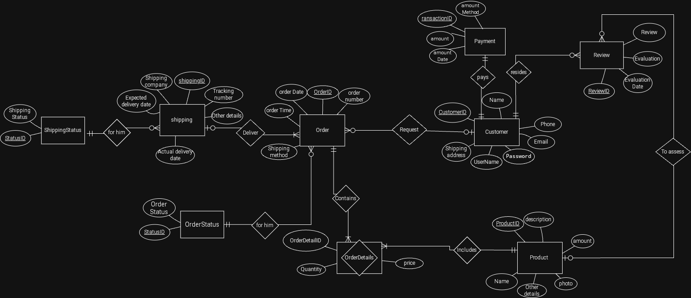
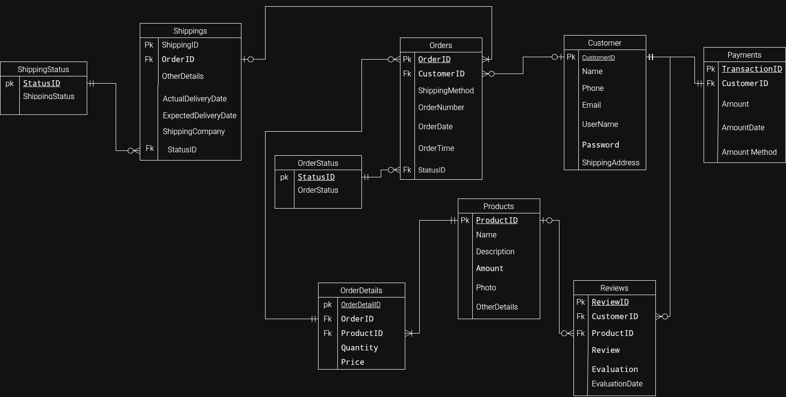

# E-commerce Database Design 🛒

A comprehensive database design project for managing e-commerce operations. This project covers the entire lifecycle from logical requirements (ERD) to relational mapping (Schema).

---

## 📋 System Requirements

### 1. Customer & Product Management
* Maintains comprehensive records of customers, including personal information, login credentials, and shipping addresses.
* Stores and manages product details such as descriptions, prices, stock levels, and product photos.

### 2. Order & Shipping Workflow
* Tracks the entire ordering process, from customer requests to final delivery.
* Manages order details including quantities and pricing, alongside real-time shipping status and tracking information.

### 3. Payments & Customer Engagement
* Handles payment transactions securely, linking them to specific customers and order history.
* Enables customers to provide feedback and evaluations through a structured review system linked to purchased products.

---

## 🖼️ 1. Entity-Relationship Diagram (ERD)
The logical model focusing on entities, attributes, and business rules.

---

## 🛠️ 2. Relational Schema
The transition from logical design to relational structure.

### 🔑 Key Implementation Details:
* **Order Integrity:** A robust link between `Orders` and `OrderDetails` ensures accurate tracking of items purchased within a single transaction.
* **Shipping Lifecycle:** Integration between `Shipping` and `ShippingStatus` tables allows for dynamic updates on delivery progress.
* **Customer Feedback Loop:** The `Review` entity creates a direct connection between `Customer` and `Product`, facilitating better service quality.

---

## 📂 Project Files
Access the source files in this repository:

* **ER Diagram File:** [ERD](Project_5_OnlineStore_ERD.png)
* **Relational Schema File:** [Relational Schema](OnlineStore_Relational_Schema.drawio.png)
* **PDF : ** [OnlineStore_Database Design]
---

## 🚀 Tools Used
* **Draw.io** - For designing the ERD and Schema diagrams.
* **SQL** - For defining the relational database structure.
* **GitHub** - For version control and portfolio hosting.

---
**Developed by: Mohammed Zuhair Al-shell ✍️
